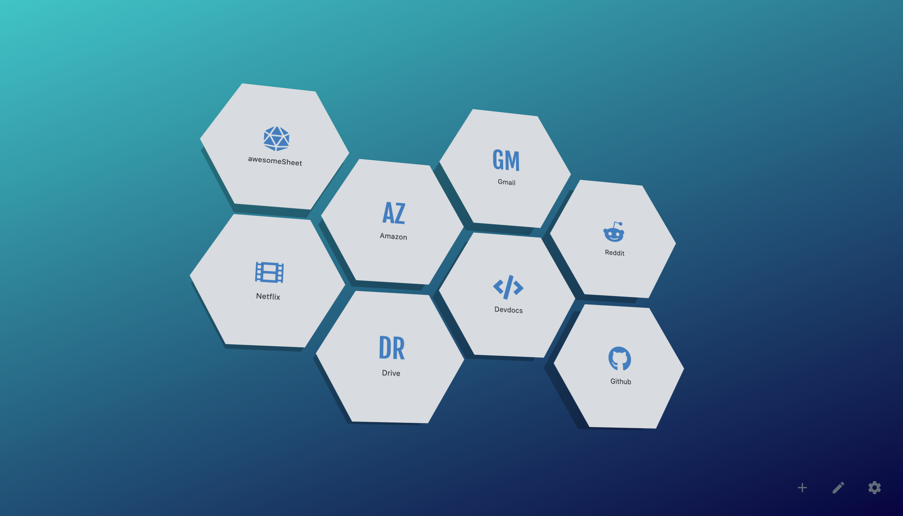
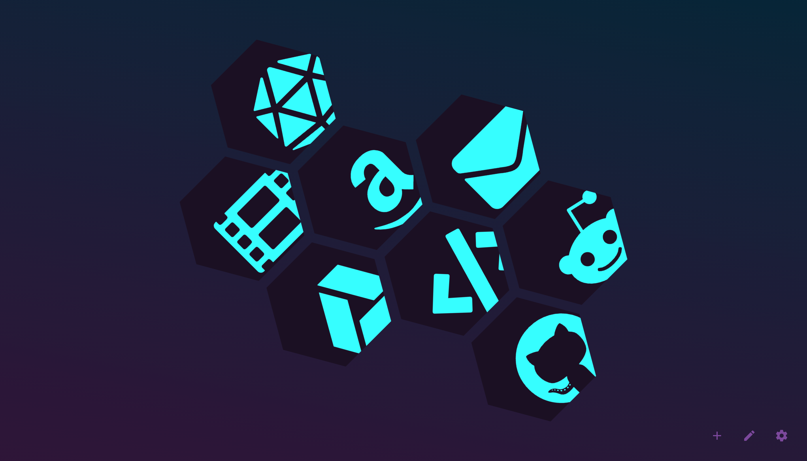
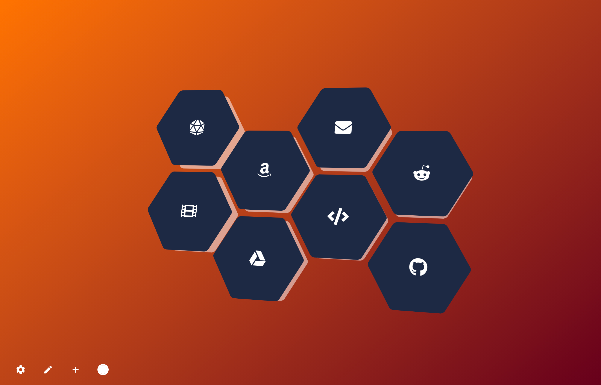

# hexagonTab
Hexagon bookmarks accented with a chosen colour. Customise the layout, style and background with hexagonTab - a custom start page.

| [See the demo in action](https://zombiefox.github.io/hexagonTab/) | [Install hexagonTab Extension](https://chrome.google.com/webstore/detail/nighttab/hdpcadigjkbcpnlcpbcohpafiaefanki) | [Install hexagonTab Add On](https://addons.mozilla.org/en-GB/firefox/addon/nighttab/) | [Buy me a coffee](https://www.buymeacoffee.com/zombieFox/) |
|:-------------:|:-------------:|:-------------:|:-------------:|
|  |  |  |  |

---

### Development

When developing use:
- `npm start`

A development server will run on `http://localhost:8080/`

To build the project use:
- `npm run build`

A web ready folder will be created in `/dist/web/`.
A browser addon/extension ready zip will be created in `/dist/extension/`.
