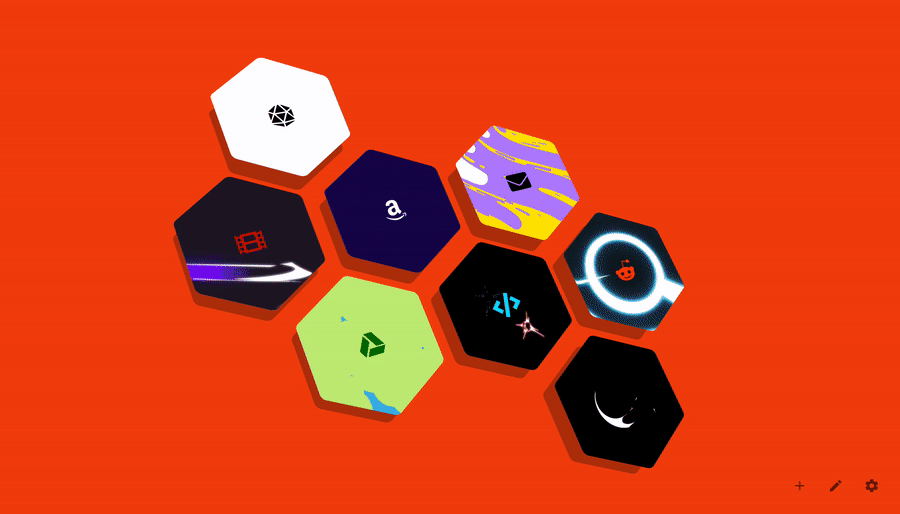

# hexagonTab
Hexagon bookmarks accented with a chosen colour. Customise the layout, style and background with hexagonTab - a custom start page.

Save bookmarks to your start page on a unique hexagonal grid. hexagonTab keeps the new tab page clean and simple with a focus on presenting links to your most frequented sites.

| [See the demo in action](https://zombiefox.github.io/hexagonTab/) | [Install hexagonTab Extension](https://chrome.google.com/webstore/detail/hexagontab/hjapnkiokjkamfjenbdagacmpkobjlgi) | [Install hexagonTab Add On](https://addons.mozilla.org/en-GB/firefox/addon/hexagontab/) | [Buy me a coffee](https://www.buymeacoffee.com/zombieFox/) |
|:-------------:|:-------------:|:-------------:|:-------------:|
|  |  |  |  |

# Support

- [Applying bookmark settings to all](https://github.com/zombieFox/hexagonTab/wiki/Applying-bookmark-settings-to-all)
- [Browser support](https://github.com/zombieFox/hexagonTab/wiki/Browser-support)
- [Cookies and cache](https://github.com/zombieFox/hexagonTab/wiki/Cookies-and-cache)
- [Data backup and restore](https://github.com/zombieFox/hexagonTab/wiki/Data-backup-and-restore)
- [Protected URLs](https://github.com/zombieFox/hexagonTab/wiki/Protected-URLs)
- [Recovering settings and bookmarks](https://github.com/zombieFox/hexagonTab/wiki/Recovering-settings-and-bookmarks)
- [Resetting when opening the browser](https://github.com/zombieFox/hexagonTab/wiki/Resetting-when-opening-the-browser)
- [Respecting your privacy](https://github.com/zombieFox/hexagonTab/wiki/Respecting-your-privacy)
- [Setting a background video or image](https://github.com/zombieFox/hexagonTab/wiki/Setting-a-background-video-or-image)
- [Setting hexagonTab as your Firefox homepage](https://github.com/zombieFox/hexagonTab/wiki/Setting-hexagonTab-as-your-Firefox-homepage)

# Development

When developing use:
- `npm start`

A development server will automatically open the project in your browser. Normally here: `http://localhost:8080`.

To build the project use:
- `npm run build`

A web ready folder will be created in `/dist/web/`.
A browser addon/extension ready zip will be created in `/dist/extension/`.

# Screenshots

## Example hexagonTab setups:

- [Where to find these setups](https://github.com/zombieFox/hexagonTab/tree/main/asset/screenshot)
- [How to import these setups](https://github.com/zombieFox/hexagonTab/wiki/Data-backup-and-restore#restore-data)

